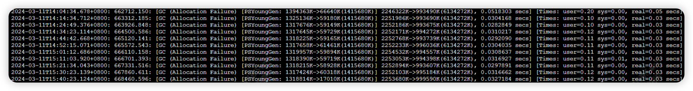

### JVM内存模型
 
 * java内存模型
 
        java内存模型定义了程序对各个变量的访问规则,这里的变量指的是实例字段、静态字段和构成数组对象的元素,
        并不包括局部变量和方法参数,因为局部变量个方法参数属于栈帧操作,是线程私有的
        java中的每个线程都有自己的工作内存,工作内存中保存了主存的变量的拷贝,线程只能和工作内存打交道,这就导致
        工作内存中有些数据可能和主存存在差异,产生缓存一致性问题   
        
 * 缓存一致性的解决办法
        
        锁机制和volatile关键字(详情参考jdk.md)     
        
### JVM内存区域

  * JVM的简单构成
 
         JVM可以简单概括为运行时数据区域、执行引擎、本地接口库。
         运行时数据区域用于我们JAVA程序的运行。
         执行引擎用于将JVM字节码转换为真实机器可以识别的机器码。
         本地接口库用于C端代码的调用。
      
  * 运行时数据区域
         
         运行时数据区域包括如下五部分
         方法区、本地虚拟机栈、虚拟机栈、堆、程序计数器
         其中方法区和堆是线程共有的, 本地虚拟机栈、虚拟机栈和程序计数器是线程私有的

         程序计数器: 
              该区域用于当前线程所执行的字节码的行号指示器, 确保线程在获取CPU的使用权时可以接着上次的逻辑继续执行。
              分支选择、循环、跳转、异常、线程恢复等都是通过该区域实现的。

              该区域不会发生OOM

         Java虚拟机栈:
               该区域描述的是Java方法执行的内存模型。每个方法都对应一个栈帧。方法的执行就相当于栈帧的入栈和出栈。
               每个栈帧中又包括局部变量表、操作数栈、动态链接和方法出口等信息。
               局部变量表： 保存着方法用到的变量
               操作数栈：操作的数据,JVM先将数据入栈,在出栈赋给局部变量表
               动态链接：该方法在方法区的内存地址,用于获取静态变量
               返回地址：存储该方法执行完成后下一步指令的位置

               该区域当栈深度过高, 会触发StackOverflowError异常(迭代程序可能引发该错误)
               Java虚拟机栈的内存大小可以扩展, 当扩展时无法申请资源时, 会触发OOM异常
              
         本地虚拟机栈:
               同Java虚拟机栈, 不同的是该区域执行的是本地方法(native()方法)。

               该区域当栈深度过高, 会触发StackOverflowError异常(迭代程序可能引发该错误)
               本地虚拟机栈的内存大小可以扩展, 当扩展时无法申请资源时, 会触发OOM异常
         
         方法区:
               该区域存储了类加载器加载的信息,比如类信息、常量、静态变量等。
               同时该区域也存储了类对应的Class对象。
               方法区在1.8之前的实现是永久代, 1.8之后的实现是元空间
               
               当没有内存用于存储信息时,会触发OOM
               
               方法区中有一块区域叫做运行时常量池, 用于存储编译期生成的字面量和符号引用, 该区域内的数据不一定必须在JVM启动时生成
               也可以在运行期间放入, 比如String.intern()方法。

         Java堆:
               该区域用于存储JVM中的对象实例和数组(Class对象比较特殊,存储在方法区中)。
               为了更精确的管理对象,又分为新生代和老年代, 新生代又分为Eden区、From区和To区, 比例为8:1:1

               当没有内存用于分配新实例时,会触发OOM

  * 直接内存
        
        JDK1.4新加入了NIO类,可以直接在JVM外部分配内存, 该机制明显提升了复制性能, 避免了java堆和Native堆中来回复制数据。
        该部分内存受到整体内存影响, 也会发生OOM

### 类加载机制

   * 类加载过程(类的生命周期)
          
          加载--> 连接(验证、准备、解析)--> 初始化--> 使用--> 卸载
  
   * 加载阶段
         
         该阶段主要完成三件事情:
         1. 通过一个类的全限定名获取类的二进制字节流(获取的方式不限, 可以是jar包、网络、或者动态生成)。
         2. 在方法区生成该类的运行时数据结构(该结构可以获取类的信息)。
         3. 生成该类Class对象作为该类运行时数据结构的的入口(用于反射) 。

   * 验证阶段
          
          该阶段用于验证类的二进制字节流是否符合虚拟机规范, 用于确保虚拟机自生的安全。

   * 准备阶段 
          
          该阶段用于类变量(被static修饰的变量)分配初始值,这里只是分配初始值,static int = 12; 这里的赋值为0, 相当于分配空间。
          被final修饰的类变量不参与分配过程, 其在编译期已经被优化为常量了。

   * 解析阶段
          
          该阶段用于将常量池中字面量的符号引用替换为JVM内存中的直接引用。也就是在JVM中正确的映射我们代码中类之间的关联关系。
          符号引用：用于描述所引用的符号, 也就是我们的变量, 编写代码时我们通过变量和指定各个类之间的关联关系。
          直接引用：JVM中的指针或者句柄, 用于定位内存地址。

   * 初始化阶段
          
          该阶段的主要作用是执行<clint>方法, 也就是执行我们的代码中的类变量(static)和静态代码块。
          准备阶段实现类变量的初始值分配, 初始化阶段就是真正执行我们代码的赋值了。

          执行顺序问题: 
             1. 先执行父类, 再执行子类。
             2. 同一类中, 按照代码出现的顺序执行。

   * 使用阶段
          
          该阶段就是在代码中对该类进行实例化、反射等实际操作了。

   * 卸载阶段
          
          JVM并不会卸载已加载的类信息, 但是后期的热部署等都需要实现类卸载逻辑。

### 双亲委派机制

 * 类加载器
        
        类加载机制中的加载阶段是由类加载器实现的。
        每个加载器都有自己的类空间。同一个类加载器只能对一个类加载一次, 但一个类可以被不同的类加载器加载。
        被不同类加载器加载的同一个类, 在执行equals()等比较方法时返回的为false。
        
        官方提供了三种官方类加载器, 每个类加载器都有自己固定扫描的路径,各司其职, 互不干涉, 具体如下: 

        BootstrapClassLoader: 启动类加载器,是虚拟机的一部分,通过C++程序编写, 加载JAVA_HOME/lib包下的指定jar
        ExtClassLoader：扩展类加载器,虚拟机外部的,通过JAVA编写, 加载JAVA_HOME/lib/ext包下的指定jar
        AppClassLoader: 应用程序类加载器,虚拟机外部的,通过JAVA编写, 加载classpath下的文件
       
        当上述三类场景无法我们的需求时, 我们可以使用官方预留的自定义类加载器来实现自己的类加载逻辑。
 
               
 * 双亲委派模型
        
        为了避免类的重复加载和保护核心类功能不被篡改, JDK提出了类加载器的双亲委派模型, 具体定义如下: 
        除了启动类加载器以外,任何的类加载器都需要有自己的父类加载器,并不是继承父类而是保存了父类加载器信息(组合模式)
        当一个类加载器需要加载类时,首先会委派自己的父类去加载,父类加载器无法加载时,自己再加载该类
        
        JAVA中的实现逻辑, 查找当前类加载器是否加载过了,没有的话判父加载器是否为null,如果不为null,重复之前步骤
        当父类加载器为null时,就通过启动类加载器加载,依旧无法加载,抛出一个异常后再由当前类加载器加载
        
 * 打破双亲委派模型
        
        双亲委派模型只是一个规范, 该规范在必要的情况下是可以打破的, 有三类打破该模型的场景:
        场景一: 双亲委派是JDK1.2 提出的, 但是类加载是JDK1.1 提出的, 这就导致1.1至1.2这期间内的相关开发都不满足。
        场景二: SPI机制, JDK核心包中定义了很多接口规范, 但是具体的实现代码在calsspath层, 此时通过线程上下文加载器实现了由上至下的类加载。
        场景三: 热部署, 热部署通过自定义类加载器改变了双亲委派机制。
        
 * loadClass()和findClass()的区别
        
        loadClass()是JDK1.1版本发布的,双亲委派的逻辑就在该类中。
        findClass()是JDK1.2版本发布的,该方法在loadClass()中执行,用于用户自定义类加载逻辑, 同时不破坏双亲委派机制。
        
        这也是双亲委派的一个保证,先调用loadClass()通过父类去加载,父类加载不到的话在通过findClass()自己去加载

### 对象创建

 * 对象创建的过程

        我们通常使用new关键字创建对象, 在编译期间, 编译器会将new关键字替换为对应的构造方法, 在运行期间, 虚拟机会调用构造方法创建对象。
        在遇到new命令时,具体过程如下
           1. JVM会先在方法区的运行时常量池寻找对应的符号引用, 并检查对应的类是否已经完成了加载、解析和初始化(也就是是否被类加载器加载)
           2. 确保类加载完毕后,会在堆内存中为该实例分配内存。该过程是多线程并发的过程, 存在竞争问题, 常用的解决办法就是CAS和TLAB(每个线程有自己的区域)
              分配的方式根据内存是否连续又细分为指针碰撞和空闲列表两种方式。
           3. 分配好内存后, 会被实例的内存空间初始化零值(不包括对象头), 并初始化对象头的信息, 包括所属类的信息、哈希码、GC年龄等信息。
           4. 执行<init>初始化方法, 初始化对象的具体值。

 * 对象的组成
       
        对象包含三部分: 对象头、实例数据、对其填充。
        对象头: 该部分用于存储实例的运行时数据, 包括哈希码、GC分代年龄、持有锁的线程、锁状态等信息。
        实例数据：该部分用于保存对象的字段信息。
        对其填充：该本部分用于保证整个对象所占用的内存必须是8字节的整数倍。

 * 对象的使用
        
        我们通过虚拟机栈上的reference来操作堆上的对象, 具体如何通过reference定位到对象有两种实现方式。
        句柄: reference指向堆中句柄地址, 句柄中保存了对象实例数据的指针和方法区中对象类型数据的指针。该方式的好处是对象改变时不需要改变栈中的reference
        直接指针: reference指向堆中实例数据指针, 实例数据中包含对象类型数据的指针。该方式的好处是访问速度快。
 
### 对象引用

        对象的引用分为如下四种:
        强引用：存在则必不会回收。
        软引用：内存不足时回收。
        弱引用：每次GC时回收。
        虚引用：无实际用处, 仅证明存在过。

### 对象如何回收

 * 什么样的实例对象可回收
    
        判断对象是否可回收通常有两个算法
        引用计数法：每个对象实例存储自身被引用的次数, 当引用次数为零时即可回收, 该算法无法处理相互引用的对象。
        可达性分析算法：我们将虚拟机栈中reference引用的对象和方法区中类变量和常量引用的对象作为GC ROOT进行关联, 关联不到的则需要回收。

 * 什么样的类对象可以回收(方法区)
        
        类的所有实例对象都已经别回收
        类加载器已经被回收
        Class对象未被任何地方引用

 * 什么样的常量可以回收(方法区)

        该常量没有对应任何堆中的实例对象代表的值

 * 回收的算法有哪些
       
        我们在确定哪些对象可以回收后,就需要考虑如何回收这些对象了, 常见的回收算法有三种
        1. 标记-清除算法, 效率高, 但是会产生大量的内存随便。
        2. 复制算法, 不会产生内存碎片, 但是会浪费一定的空间。
        3. 标记-整理, 不会产生内存碎片, 也不会浪费空间。

### HotSpot中相关实现

 * 可达性分析算法中枚举根节点的实现

       目前主流的虚拟机都采用的准确式GC, 类加载后什么数据存在哪里都是可以直接获取的, 因此我们可以很方便的定位方法区中的根节点。
       方法在运行时, 可以快速获取虚拟机栈中的引用的位置, HotSpot在编译时根据具体的命令生成具体的安全点, 线程只有在执行到安全点时,
       才能进行GC,安全点的选择主要是根据指令是否具有长时间执行来确定的,
       必须等到所有的线程都进入安全点后才可以GC, 通过主动式中断来告知线程需要进行安全点进行GC,只有所有的线程都到达安全点,才可以GC
       对于处于Sleep状态的线程, 是无法响应中断的,因此对安全点进行了优化, 对于不会引起引用发生变化的区域,我们称之为安全区,处于安全区内的线程
       就可以等待GC。

       特别说明: 对于Sleep的线程, 此时的线程在安全区内, 当起来时处于GC,或者已发出GC中断消息, 必须等到GC结束才能出安全区,
       这就导致有时睡眠1s, 实际3秒后才唤醒

       我们循环时变量应该定义为long, 而不是int, long是不确定次数, 会设置安全点, int 是确定次数, 不会设置安全点。

 * 垃圾回收算法的具体实现
      
       JVM采用分代的思想管理内存, 根据新生代和老年代的不同特质, 需要实现不同的垃圾收集器。
       第一代: Serial(新生代) 、 SerialOld(老年代)   两个收集器都是单线程进行垃圾收集的。
       为了解决单线程收集速度慢的问题, 引入了多线程版本的垃圾收集器
       Parallel Scavenge(新生代) 、 CMS(老年代) , 尴尬的是两者不能搭配使用, 因此推出了Parallel Scavenge(新生代)对应的老年代收集器Parallel Old
       Parallel Scavenge关注的是吞吐量, 因此又推出了ParNew(新生代), 该收集器专注于低延时
       
       最后推出了不区分新生代和老年代的G1收集器

       除了CMS和G1收集器外,其余收集器在收集期间都会STW,
       
       CMS收集器的过程：初始标记、并发标记(可执行用户线程)、重新标记、并发执行(可执行用户线程)
       G1收集器的过程：初始标记、并发标记(可执行用户线程)、最终标记、筛选回收
       

 * GC的吞吐量和低延时概念

        场景假设: 每10秒执行一次GC, 每次耗时100ms, 现在修改为每5s执行一次GC, 每次耗时60ms, 此时响应速度更快了, 但是10s内的GC耗时由100ms
        生成至120ms, 吞吐量降低了。

       吞吐量指的的用户线程消耗CPU时间占总时间的占比, 该比值越高, 吞吐量越高
       高吞吐量意味着GC的次数要少, 相应的一次GC的时间会长点
       
       低延时意味着每次GC的时间要尽量短, 这就意味着GC的频率更高, 吞吐量低。

       参考文献：https://blog.csdn.net/lijibai_/article/details/126302888
       
       
 * GC日志查看

        参考博客: https://juejin.cn/post/7013196715398283272

       
       
 
 * 内存分配与回收策略

       1. 正常情况下新创建的对象首先会被分配到新生代的Eden区, 当Eden区空间不足时, 会触发Minor GC, 对象的生存年龄+1
          当对象大于新生代的From区时, 直接分配到老年代。
          当Minor GC后, Eden区+From区的可存活对象大于To区, 对象直接进入老年代
          对象的存活年龄到达阈值时, 进入老年代
          
       2. 当老年代无法容乃下新的对象时, 触发fullGC

### 常用的JVM命令

 * jps(JVM Process Status) 

       jps 命令用于查看系统中正在执行的java进程的信息, 默认输出进程ID和jar包名称。常用参数如下:
       -l 输出主类的名称, jar启动的输出jar包路径
       -v 输出启动时传递的参数
       -m 出去传递给主类的参数
 * jstat(JVM Statistics Monitoring Tool) 
   
       jstat 命令用于监控JVM中方各项运行状态信息, 可以查看类装载、内存、GC、JIT编译等运行数据
       
       jstat <option> vmid [interval] [count]  
       jstat -gc 10 1000 10      监控线程ID为10的线程的gc情况,没1000ms输出一次,共输出10次

 * jinfo(Configuration Info for Java) 

       jinfo命令用于实时查看和调整JVM的各项参数。

       jinfo -flags 11   查看指定的参数

 * jmap(Memory Map for Java)
 
       jmap 用于获取堆信息的, 常用的为 -heap 查看此时堆内存占用信息    -histo:live   查看存活对象信息

 * jstack(Stack Trace for Java)
 
       jstack命令用于生成JVM此刻的线程快照信息
      
### CPU飙升如何排查       
### OOM如何排查

 * OOM分类
    
        JVM设置的内存过小(内存溢出)
        应用的内存无法释放(内存泄漏)

 * OOM常见情况
        
        堆溢出：内存泄漏或堆大小太小造成
        方法区溢出：Class文件太多或者动态生成的Class太多    
        栈溢出：死循环或者深度递归造成   

### JVM常用参数

 * 如何设置新上线的java服务的内存大小
        
        JVM大小: Full GC后老年代大小的三到四倍
        方法区大小：PermSize和MaxPermSize为Full GC后老年代的1.2到1.5倍
        年轻代：Full GC后老年代的1到1.5倍
        老年代：Full GC后老年代的2到3倍
        
        堆大小：堆大小 = 年轻代 + 年老代(xmx = xmn + 老年代)
        
  
 * 设置JVM最大内存和最小内存(通常我们将JVM最大内存和最小内存设置为相同的值防止内存波动)
        
        -Xmx512M       设置JVM最大内存
        -Xms512M       设置JVM最小内存
        -Xmn           年轻代大小
        -Xss           每个线程最大大小
        

 * 错误诊断
        
        -verbose:class  输出jvm载入类的相关信息，当jvm报告说找不到类或者类冲突时可此进行诊断。
        -verbose:gc     输出每次GC的相关情况。
        -verbose:jni    输出native方法调用的相关情况，一般用于诊断jni调用错误信息。                

    
 * 常用设置
        
        -XX:+PrintGCDetails           +表示启动   -表示禁用
        -XX:PretenureSizeThreshold    设置超过该值大小的直接进入老年代
        -XX:NewRatio=4                设置年轻代和老年代的比例
        -XX:SurvivorRatio=4           设置年轻代中Eden区与Survivor区的大小比值。设置为4，则两个Survivor区与一个Eden区的比值为2:4，一个Survivor区占整个年轻代的1/6
        
        
        -XX:+UseParallelGC -XX:ParallelGCThreads=20    年轻代使用ParallelGC,并行数为20
        -XX:+UseParallelOldGC          配置老年代GC      
        -XX:MaxGCPauseMillis=100       设置每次年轻代垃圾回收的最长时间
        -XX:+UseAdaptiveSizePolicy     设置此选项后，并行收集器会自动选择年轻代区大小和相应的Survivor区比例
        -XX:+HeapDumpOnOutOfMemoryError -XX:HeapDumpPath=./oom.hprof
        
        -XX:MaxMetaspaceSize=512m      配置元空间大小
        
 * OOM排查
        
        jps -l   查看jar信息
        jstat -gcutil pid interval   查看GC各个区域的信息
        jmap -histo:live pid    查看存活的大对象
        jmap -dump:format=b,file=文件名 [pid]   MAT分析数据
        

### 锁升级

 * 锁的概念

       锁是为了在各个线程之间更高效的共享数据, 提高程序的运行效率。JVM开发团队在多个方面作出了努力。
       
       锁消除: JVM即时编译器在执行期间,会对加锁的代码进行优化,根据逃逸分析技术发现代码执行期间,堆上的数据不会被其他线程访问到, 会将代码中的锁进行消除。
              我们在一个方法的内部使用ConcurrentHashMap来存储数据时,编译器就会通过锁消除进行优化。

       锁粗化: 当我们的一段逻辑代码中存在多个加锁代码块时, 编译器可能将这些加锁代码块进行优化合并,最终优化为一个加锁代码块。

       自旋锁: 线程的挂起和恢复是非常耗时, 为了避免线程刚挂起就被唤醒的问题, 自选锁顺应而生, 当获取锁失败时, 先自旋一定次数, 获取不到再挂起。
       
       自适应自选锁：每个锁的等待时间可能不同, 采用同样的自旋标准就存在一定的问题, 自适应自选锁顺应而生, 当获取锁的线程在运行, 根据上一个通过自选获取锁的时间来设置当前自旋时间。
       
       重量级锁: 通过操作系统的互斥量来实现线程的挂起和恢复。

       轻量级锁: 当线程发生竞争时,会通过CAS操作来尝试获取锁, 获取失败则通过自旋来获取锁, 依旧失败则会升级为重量级锁。自旋锁和自适应自旋锁都属于轻量级锁。

 * 锁升级 

